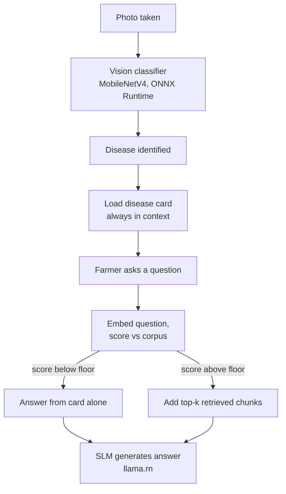

# Architecture

## What this app does

The farmer photographs a plant, gets an on-device diagnosis, and can ask
follow-up questions in a chat interface. Everything runs locally — no
server, no network dependency at inference time.

## Two-stage pipeline

**Stage 1 — Vision classification.** A MobileNetV4-conv-small model,
exported to ONNX, runs via `onnxruntime-react-native`. Single forward
pass, no generation. Output: a `class_label` plus a confidence score and
top-5 alternatives.

**Stage 2 — Grounded chat.** Once a disease is known, every message in
that session is generated by a small local LLM (SLM) via `llama.rn`,
grounded in one or both of:

- **The disease card** (`disease_docs.content_md`) — the full written
  document for the diagnosed disease. Always included. Small enough
  (a few hundred words) to never need retrieval.
- **Retrieved corpus chunks** — included only when a broader-corpus
  search scores above a similarity floor, meaning the question needs
  information the card doesn't have (e.g. seasonal fertilizer advice).
  See `docs/SCHEMA.md` for the retrieval mechanics.

There is no "intent classification" step asking the LLM whether to use
RAG. The routing decision is made deterministically, before generation,
by comparing embedding similarity scores to a calibrated floor. See
`ml/scripts/build_knowledge_db.py` for how the corpus is built and
embedded, and the app's retrieval module for the runtime scoring loop.

## Tech stack

| Layer | Choice | Why |
|---|---|---|
| App framework | React Native (Expo, TypeScript) | Team preference; faster iteration than native Kotlin for this timeline |
| Vision inference | `onnxruntime-react-native` | Single-shot inference bridge; no generation loop needed |
| LLM inference | `llama.rn` (llama.cpp bindings) | Handles tokenizer, KV cache, sampling — none of which ORT provides |
| Embedding inference | llama.rn's embedding mode (preferred) or ONNX + JS tokenizer (fallback) | Reuses the LLM engine/tokenizer; avoids a second runtime and tokenizer problem |
| Knowledge storage | SQLite (`expo-sqlite`), file `knowledge.db` | Read-only, bundled, rebuilt offline by Python |
| App/user data storage | SQLite (`expo-sqlite`), file `app.db` | Read-write, created on-device, migrated in-app |
| Chat UI | `react-native-gifted-chat` (or adapted PocketPal AI chat screen) | Standard RN chat component |
| Vector search | None (brute-force dot product in JS) | Corpus is a few hundred–thousand chunks; ANN indexing is unneeded complexity at this scale |

## Why two separate databases

`knowledge.db` is content the team writes and ships with app updates.
`app.db` is data the app generates per user, on-device. Merging them
would mean every content update risks user data, and every schema
migration has to reason about both. See `docs/SCHEMA.md` for the full
table-by-table breakdown.

## Known risks / things to verify early

- **SLM latency on real target hardware** — benchmark before locking a
  model choice; simulator numbers are not representative.
- **Embedding model language coverage** (French/Arabic) — verify before
  building the full corpus around it.
- **`class_label` consistency** — the vision model's output labels,
  `diseases.class_label`, and `corpus/diseases/<label>/` folder names
  must match exactly. The build script fails loudly on mismatch by
  design — do not work around that check.
- **Preprocessing parity** — the ONNX classifier's resize/normalization
  in-app must exactly match training-time preprocessing, or the model
  runs without erroring but returns wrong predictions.